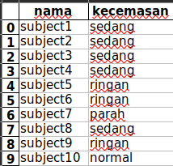
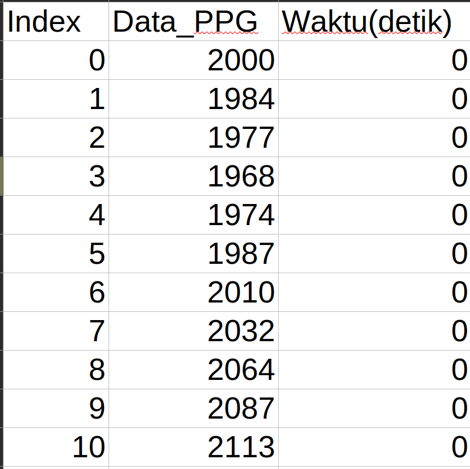
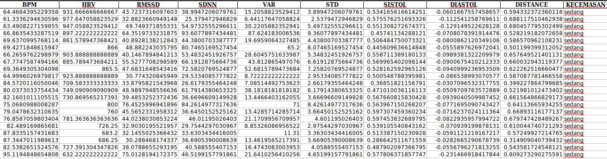

# project-test-tb-team

## setup

- buka folder data_fix, di sana ada 10 data sensor PPG yang bisa kalian
  olah. Setiap file memiliki tingkat kecemasan berbeda seperti gambar di bawah ini

  

  tingkat kecemasan nantinya akan kita gunakan untuk train machine learning (y_train).

- ada 3 column yang harus diperhatikan (Index, Data_PPG, dan Waktu(detik))
  
- read 10 data tersebut menggunakan library pandas, atau library manapun yang kalian mau
- buat sendiri nama columnnya agar lebih mudah mengolah datanya

## preprocessing

- lakukan preprocessing data PPG seperti yang kalian kuasai, setiap orang setidaknya memiliki 1 cara preprocessing data PPG yang berbeda dengan orang lain (boleh pakai bandpass filter, butterworth, highpass filter, dll)
- disarankan untuk melakukan windowing data PPG agar data train kalian nanti menjadi banyak
  ini contoh kodenya :

```python
window_size = 6000
window_step = 1800


file_segmen = []
for no_segmen in range(0,len(label)):
    file[label[no_segmen]].columns = ["Index","Data_PPG","waktu"]
    path1 = file[label[no_segmen]][(file[label[no_segmen]].waktu >10)]
    path1 = path1[(path1.waktu <=190)]

    for no_window in range(0,len(path1),window_step):
        window = path1[no_window:no_window+window_size]
        file_segmen.append(window)
```

## fitur

- cari setidaknya 2 fitur per orang (sama gapapa deh, soalnya susah nyari jurnalnya)
- olah datanya berdasarkan fitur yang kalian tau
  dari data seperti ini 
  menjadi seperti ini (contoh yang saya berikan miliki 9 fitur) 

### contoh kode pengolahan fitur bisa kalian lihat di file [OLAH_DATA_FIX](./data_fix/OLAH_DATA_FIX.ipynb)

## machine learning

setelah fitur dan label terbentuk, kalian bisa membuat machine learning sederhana untuk memprediksi kecemasan (y_train : column "KECEMASAN") melalui fitur(x_train : column "[BPM, HRV, RMSSD, dan lainnya]")

model machine learningnya juga bisa dibedakan oleh setiap orang dan usahakan kalian paham perhitungan di dalam machine learning yang kalian buat

### contoh kode machine learning bisa kalian lihat di file [contoh_kode_knn](./data_fix/contoh_kode_knn.ipynb)
